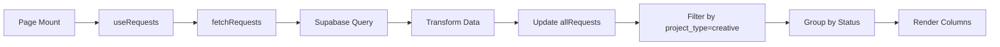

# Creative Kanban Board - Functionality Specifications

## Overview
The Creative Kanban Board is a visual workflow management system for tracking creative assets through their lifecycle from request to completion.

## Architecture

### File Structure
```
pages/
├── creative/
│   ├── index.vue           # Main kanban board
│   └── asset/
│       └── [id].vue         # Asset detail viewer
composables/
├── useRequests.ts           # Data fetching and management
├── useSupabase.ts          # Supabase client and utilities
utils/
└── figma.ts                # Figma URL utilities
```

## Data Model

### Database: Supabase
**Table:** `public.requests`

```sql
CREATE TABLE requests (
  id UUID PRIMARY KEY DEFAULT gen_random_uuid(),
  project_type TEXT CHECK (project_type IN ('creative', 'performance', 'design', 'ugc')),
  status TEXT CHECK (status IN ('new-request', 'in-progress', 'needs-review', 'needs-edit', 'done')),
  title TEXT NOT NULL,
  format TEXT,
  size TEXT,
  dimensions TEXT,
  duration TEXT,
  video_url TEXT,
  thumbnail_url TEXT,
  figma_url TEXT,
  assignee TEXT,
  due_date DATE,
  tags TEXT[],
  priority TEXT CHECK (priority IN ('Low', 'Medium', 'High', 'Critical')),
  client TEXT,
  campaign TEXT,
  category TEXT,
  created_at TIMESTAMPTZ DEFAULT NOW(),
  updated_at TIMESTAMPTZ DEFAULT NOW()
);
```

### TypeScript Interfaces

```typescript
interface Request {
  id: string
  projectType: 'creative' | 'performance' | 'design' | 'ugc'
  status: 'new-request' | 'in-progress' | 'needs-review' | 'needs-edit' | 'done'
  title: string
  format?: string | null
  size?: string | null
  dimensions?: string | null
  duration?: string | null
  thumbnail?: string
  figmaUrl?: string
  videoUrl?: string
  metadata: {
    assignee?: string | null
    dueDate?: string | null
    tags?: string[]
    priority?: 'Low' | 'Medium' | 'High' | 'Critical' | null
    client?: string
    campaign?: string
  }
  comments?: any[]
  createdAt: string
  updatedAt: string
}
```

## Kanban Board Features

### 1. Column Layout
The board displays 5 status columns:

| Column | Status | Badge Color | Emoji |
|--------|--------|-------------|-------|
| New Request | `new-request` | Purple | 📬 |
| In Progress | `in-progress` | Amber | 🔄 |
| Needs Review | `needs-review` | Blue | 👀 |
| Needs Edit | `needs-edit` | Orange | ✏️ |
| Done | `done` | Green | ✅ |

### 2. Asset Cards

Each asset card displays:
- **Thumbnail/Preview:**
  - Video: First frame preview with play icon
  - Figma: Embedded iframe preview
  - Fallback: Gradient background
- **Title:** Asset name
- **Metadata:** Format, size, dimensions, duration
- **Properties:** Assignee, due date, tags, priority
- **Status Badge:** Current workflow status
- **Comments Count:** Number of comments

### 3. Asset Routing Rules

**Decision Logic:**
```javascript
if (asset.figmaUrl) {
  // Open Figma directly in new tab
  window.open(asset.figmaUrl, '_blank')
} else {
  // Open in asset viewer canvas
  navigateTo(`/creative/asset/${asset.id}`)
}
```

**Routing Matrix:**
| Asset Type | Has figmaUrl | Action |
|------------|--------------|--------|
| Figma Design | ✅ Yes | Open Figma in new tab |
| Video | ❌ No | Open asset viewer |
| Image | ❌ No | Open asset viewer |
| Other | ❌ No | Open asset viewer |

## Data Flow

### 1. Initial Load


### 2. Asset Click Flow
```
User clicks asset card
    ↓
Check if figmaUrl exists
    ↓
YES → window.open(figmaUrl, '_blank')
NO  → navigateTo(/creative/asset/[id])
```

### 3. Asset Viewer Load
```
Navigate to /creative/asset/[id]
    ↓
Check if requests loaded (allRequests.length)
    ↓
If empty → fetchRequests() from Supabase
    ↓
getRequestById(id)
    ↓
Render asset based on type:
  - Video: HTML5 video player with Supabase CDN URL
  - Image: img tag
  - Figma: iframe embed
```

## Key Components

### 1. Creative Kanban Board (`pages/creative/index.vue`)

**Responsibilities:**
- Fetch creative requests from Supabase
- Group requests by status
- Render kanban columns
- Handle asset card clicks
- Display empty states

**Key Methods:**
- `handleAssetClick(asset)` - Route to Figma or asset viewer
- `getAssetGradient(id)` - Generate fallback gradient
- `requestToAsset(request)` - Transform data format

### 2. Asset Viewer (`pages/creative/asset/[id].vue`)

**Responsibilities:**
- Fetch specific asset data
- Display video/image/Figma content
- Show metadata and properties
- Display comments thread
- Video playback controls

**Key Features:**
- Auto-detect asset type (video vs image)
- Video controls (play, pause, fullscreen, timeline)
- Comments section with reply threads
- Info tab with editable fields

### 3. useRequests Composable (`composables/useRequests.ts`)

**Core Functions:**

```typescript
// Fetch all requests from Supabase
fetchRequests(): Promise<void>

// Get requests filtered by project type
getRequestsByType(projectType: 'creative'): ComputedRef<Request[]>

// Get requests grouped by status
getRequestsByTypeAndStatus(projectType: 'creative'): ComputedRef<{
  'new-request': Request[]
  'in-progress': Request[]
  'needs-review': Request[]
  'needs-edit': Request[]
  'done': Request[]
}>

// Get single request by ID
getRequestById(id: string): ComputedRef<Request | undefined>

// Transform to legacy format
requestToAsset(request: Request): Asset

// Get statistics
getStats(projectType?: 'creative'): ComputedRef<Stats>
```

### 4. useSupabase Composable (`composables/useSupabase.ts`)

**Core Functions:**

```typescript
// Create Supabase client
const supabase = createClient(url, anonKey)

// Upload video to Supabase Storage
uploadVideo(file: File, folder?: string): Promise<string>

// Upload image to Supabase Storage
uploadImage(file: File, folder?: string): Promise<string>

// Get public URL from Storage
getPublicUrl(bucket: string, path: string): string

// Generate video thumbnail
generateVideoThumbnail(videoFile: File): Promise<Blob>
```

## Environment Variables

### Required (Vercel/Production)
```env
SUPABASE_URL=https://[project-ref].supabase.co
SUPABASE_ANON_KEY=[your-anon-key]
SUPABASE_SERVICE_KEY=[your-service-key]
```

### Nuxt Runtime Config
```typescript
runtimeConfig: {
  supabaseServiceKey: process.env.SUPABASE_SERVICE_KEY,
  public: {
    supabaseUrl: process.env.SUPABASE_URL,
    supabaseAnonKey: process.env.SUPABASE_ANON_KEY
  }
}
```

## Asset Upload Workflow

### Video Assets
1. **Upload to Supabase Storage:**
   ```bash
   pnpm tsx scripts/upload-rams-video.ts
   ```

2. **Script Actions:**
   - Reads video from `public/videos/`
   - Uploads to Supabase Storage bucket `creative-assets`
   - Gets public CDN URL
   - Updates database `video_url` field

3. **Result:**
   - Video URL: `https://[project].supabase.co/storage/v1/object/public/creative-assets/videos/[filename].mp4`
   - Globally accessible via CDN
   - Automatic caching

### Figma Assets
1. **Add to database:**
   - Set `figma_url` field with Figma share link
   - Format: `https://www.figma.com/design/[file-id]/[name]?node-id=[node-id]`

2. **Automatic conversion:**
   - Board: Shows embedded preview
   - Click: Opens original Figma URL in new tab

## UI Components & Styling

### Design System
- **Colors:** Tailwind CSS with custom gray palette
- **Typography:** Inter font family
- **Icons:** Material Icons
- **Layout:** Flexbox with fixed column widths (320px)

### Card Styling
```css
.asset-card {
  @apply bg-white rounded-xl border border-gray-200;
  @apply shadow-sm hover:shadow-md transition-all;
  @apply cursor-pointer;
}
```

### Empty State
```html
<div class="text-center py-8 text-gray-400 text-sm">
  No assets in this column
</div>
```

## Performance Optimizations

### 1. Data Fetching
- Single query for all requests
- Client-side filtering by project type
- Reactive computed properties for grouping

### 2. Video Handling
- Preload metadata only (not full video)
- Poster frame for thumbnails
- CDN delivery for fast streaming

### 3. Figma Embeds
- Lazy-loaded iframes
- Pointer-events disabled on board preview
- Full interaction in asset viewer

## Error Handling

### Common Scenarios

**1. Missing Environment Variables**
```javascript
Error: supabaseUrl is required
```
**Solution:** Add SUPABASE_URL and SUPABASE_ANON_KEY to Vercel env vars

**2. Empty Database**
```javascript
Total creative requests: 0
```
**Solution:** Run migration and seed data:
```bash
# Create schema
psql -f supabase/migrations/20250110_create_requests_schema.sql

# Add mock data via Supabase SQL Editor
```

**3. Video Not Loading**
```
Asset viewer shows "Loading asset..."
```
**Solution:** 
- Check video_url in database
- Ensure URL is public Supabase CDN URL
- Run upload script: `pnpm tsx scripts/upload-rams-video.ts`

## Testing

### Manual Testing Checklist
- [ ] Board loads with 2 demo assets (Google Ad + RAMS Video)
- [ ] Columns show correct counts
- [ ] Figma asset opens in new tab
- [ ] Video asset opens in viewer
- [ ] Video plays in viewer
- [ ] Comments display
- [ ] Back button returns to board

### Debug Console Logs
```javascript
// Board loading
🔄 Fetching requests...
✅ Requests fetched!
📦 All requests: [...]
🔢 Total creative requests: 2

// Asset click
👁️ Asset clicked: [id] [title]
🎨 Figma asset detected - Opening in Figma: [url]
// OR
📹 Non-Figma asset - Opening in canvas viewer

// Asset viewer load
📬 [Asset Page] Checking if requests need to be fetched...
🔄 [Asset Page] Fetching requests from Supabase...
✅ [Asset Page] Requests loaded: 10
🎬 [Asset Page] Request data: {...}
```

## Future Enhancements

### Planned Features
1. **Drag & Drop:** Move cards between columns
2. **Bulk Actions:** Select multiple assets
3. **Filters:** Filter by assignee, priority, tags
4. **Search:** Full-text search across assets
5. **Upload UI:** Direct upload from board
6. **Notifications:** Real-time updates via Supabase Realtime
7. **Comments:** Reply threads and @mentions
8. **Activity Log:** Track changes and history

### Technical Improvements
1. **Optimistic Updates:** Instant UI feedback
2. **Pagination:** Load more assets on scroll
3. **Caching:** Cache requests in localStorage
4. **Offline Mode:** PWA with service worker
5. **Image Optimization:** Automatic thumbnail generation

## Troubleshooting

### Issue: Assets not showing on board
**Diagnosis:**
1. Check browser console for errors
2. Verify Supabase env vars in Vercel
3. Check database has data: `pnpm tsx scripts/check-supabase-data.ts`

**Fix:**
```bash
# Verify env vars
echo $SUPABASE_URL

# Check database
pnpm tsx scripts/show-creative-requests.ts

# If empty, add test data via SQL Editor
```

### Issue: Asset viewer shows blank page
**Diagnosis:**
1. Check URL format: `/creative/asset/[uuid]`
2. Verify request ID exists in database
3. Check browser console for fetch errors

**Fix:**
- Ensure `pages/creative/index.vue` exists (not `pages/creative.vue`)
- Restart dev server after file moves

### Issue: Video won't play
**Diagnosis:**
1. Check video_url in database
2. Verify URL is accessible (test in browser)
3. Check network tab for CORS errors

**Fix:**
```bash
# Upload video to Supabase Storage
pnpm tsx scripts/upload-rams-video.ts

# Verify URL is public CDN URL
# Format: https://[project].supabase.co/storage/v1/object/public/...
```

## Support & Documentation

- **Project Docs:** `/docs/WARP.md`
- **Supabase Docs:** https://supabase.com/docs
- **Nuxt Docs:** https://nuxt.com/docs
- **GitHub Repo:** https://github.com/nikosmaheras11/AGENCY-CRM

---

**Last Updated:** 2025-01-11
**Version:** 1.0.0
